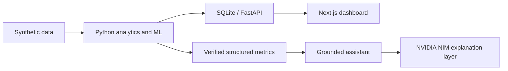

# FinSight AI

FinSight AI is a full-stack academic FinTech application for AI-based transaction intelligence and personalized digital banking. It uses synthetic banking transaction data to help users understand their financial activity through automatic categorization, spending insights, explainable unusual-transaction detection, role-based access control, and a grounded financial assistant that answers questions from verified application data.

This repository is a **decision-support prototype**, not a production banking system. Anomaly flags are not proof of fraud, real banking data is not used, and no autonomous credit or financial decisions are made. Every flagged transaction is intended for human review.

---

## Project overview

FinSight AI demonstrates how modern financial applications can combine deterministic backend analytics with optional large-language-model explanations while keeping AI governance and data privacy in mind. The system is designed so that **financial calculations are always performed by verified backend logic**. The AI model does not calculate balances, totals, percentages, or anomaly scores; it only explains already-verified results in natural language.

The application includes:

- A responsive FinTech-style dashboard built with Next.js and TypeScript
- A Python FastAPI backend with SQLite storage via SQLAlchemy
- Automatic transaction categorization using TF-IDF and Logistic Regression
- Monthly income, spending, savings, category breakdowns, and financial behaviour metrics
- Explainable unusual-transaction detection with review recommendations
- Role-based authentication for customers, bank analysts, and administrators
- A grounded financial assistant that answers questions from verified application data
- Optional NVIDIA NIM integration for richer natural-language explanations

The project also includes reproducible synthetic data generation, seeded demo users, backend API tests, and secure `.env`-based configuration.

---

## Features

- **JWT authentication** with customer, analyst, and admin roles
- **Deterministic spending profiles** with insights-ready metrics and explainable unusual-transaction flags
- **TF-IDF + Logistic Regression** transaction categorizer
- **Grounded financial assistant** that answers from verified application data
- **Optional NVIDIA NIM integration** for natural-language explanations
- **Next.js dashboard** and **FastAPI REST API**

---

## Technology stack

| Layer | Technologies |
| --- | --- |
| Frontend | Next.js, TypeScript, CSS |
| Backend | Python, FastAPI, Pydantic |
| Database | SQLite with SQLAlchemy |
| Machine learning | scikit-learn, NumPy, pandas |
| Authentication | JWT with password hashing and role controls |
| AI explanations | NVIDIA NIM through an environment-configured API key |

---

## Architecture



---

## Prerequisites

Before running the project locally, make sure you have:

- **Python 3.10+**
- **Node.js 18+**
- **Git**
- An **NVIDIA NIM API key** (free tier available) for the grounded assistant LLM layer

> **Important:** Anyone cloning and running this project on their local machine must first create their own NVIDIA API key and paste it into the `.env` file. Without a valid key, the assistant still works, but it falls back to deterministic text instead of AI-generated explanations.

---

## Getting started after cloning

Follow these steps in order after cloning the repository from GitHub.

### 1. Clone the repository

```powershell
git clone https://github.com/SSGOG/FinSight-AI.git
cd FinSight-AI
```

### 2. Create and configure your environment file

```powershell
Copy-Item .env.example .env
```

Then open `.env` and replace the placeholder values:

```env
JWT_SECRET=replace-with-a-long-random-secret
DATABASE_URL=sqlite:///./data/finsight.db
CORS_ORIGINS=http://localhost:3000
NVIDIA_NIM_API_KEY=paste-your-nvidia-nim-key-here
NVIDIA_NIM_MODEL=nvidia/nemotron-3-super-120b-a12b
```

**Do not skip this step.** The NVIDIA API key is required if you want the assistant to use the LLM explanation layer instead of the deterministic fallback.

### 3. Create your NVIDIA NIM API key

1. Go to [build.nvidia.com](https://build.nvidia.com/)
2. Sign in or create a free NVIDIA Developer account
3. Open any chat model page, such as Nemotron
4. Click **Get API Key**
5. Generate a key and copy it
6. Paste the key into `NVIDIA_NIM_API_KEY` inside your local `.env` file

Also replace `JWT_SECRET` with a long random secret string before running the app locally.

**Never commit `.env`.** It is already listed in `.gitignore`. Only `.env.example` belongs in the repository.

The API key stays on the backend only and is never exposed to the Next.js frontend.

### 4. Set up and start the backend

From the project root:

```powershell
python -m venv .venv
.venv\Scripts\activate
pip install -r requirements.txt
python scripts\generate_dataset.py
python scripts\init_db.py
uvicorn src.backend.app.main:app --reload --port 8000
```

Keep this terminal running.

### 5. Set up and start the frontend

Open a second terminal:

```powershell
cd src\frontend
npm install
npm run dev
```

### 6. Open the application

Visit:

```text
http://localhost:3000
```

Use one of the demo accounts below. All demo accounts use the password:

```text
Demo@123
```

Demo users:

- `customer@finsight.local`
- `analyst@finsight.local`
- `admin@finsight.local`

---

## NVIDIA NIM assistant behavior

Financial calculations are always performed by deterministic backend logic. The AI model does **not** calculate balances, totals, percentages, or anomaly scores — it only explains verified results in natural language.

- With a valid `NVIDIA_NIM_API_KEY`, the assistant badge shows **NVIDIA NIM grounded explanation**
- Without a key, or if the model is unavailable, the app uses a **deterministic fallback** and remains fully functional

The default model is `nvidia/nemotron-3-super-120b-a12b`. NVIDIA retires hosted models over time. If you see a fallback message mentioning a retired model, update `NVIDIA_NIM_MODEL` to one listed for your account:

```powershell
curl -H "Authorization: Bearer YOUR_NVIDIA_KEY" https://integrate.api.nvidia.com/v1/models
```

---

## Demo workflow

1. Log in as `customer@finsight.local`
2. Review the dashboard metrics and category breakdown
3. Ask the grounded assistant questions such as:
   - "Give me a summary of my finances this month."
   - "Where did I spend the most this month?"
   - "Show unusual transactions."
4. Log in as `analyst@finsight.local` or `admin@finsight.local` to review flagged transactions

---

## Tests

From the project root:

```powershell
pytest
```

---

## Data and ML

`scripts/generate_dataset.py` creates reproducible synthetic examples including salary, rent, routine spend, and an injected high-value, new-recipient, out-of-hours transfer.

The classifier uses TF-IDF features and logistic regression. The current compact demonstrator trains in memory from labelled examples. Financial totals, profiles, anomaly explanations, and assistant facts are deterministic application calculations.

---

## Security, privacy, and ethics

- Passwords are hashed
- Tokens are signed JWTs
- Role checks protect analyst review actions
- Never use real banking data in this prototype
- Configure `JWT_SECRET`, `DATABASE_URL`, and `CORS_ORIGINS` in `.env`
- `.env.example` documents the required variables
- No autonomous credit, fraud, or financial decisions are made

---

## Limitations and future work

The included data volume is intentionally small for local demonstration. Production use would require model monitoring, larger validation sets, encrypted managed storage, audit logging, and a human-review workflow. Docker support and additional LLM providers can be added after selecting the deployment environment.

---

## Repository

Private GitHub repository:

```text
https://github.com/SSGOG/FinSight-AI
```
