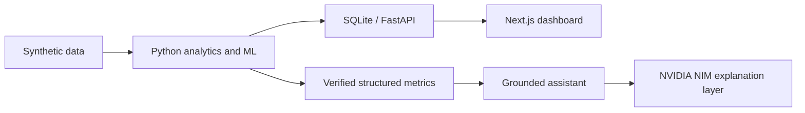

# FinSight AI

AI-based transaction intelligence and personalized digital banking assistant built with synthetic data. It is a decision-support prototype: anomaly flags are not proof of fraud and require human review.

## Features

- JWT authentication with customer, analyst, and admin roles
- Deterministic spending profiles, insights-ready metrics, and explainable unusual-transaction flags
- TF-IDF + Logistic Regression transaction categorizer
- Grounded financial assistant with verified application data
- Optional NVIDIA NIM integration for natural-language explanations
- Next.js dashboard and FastAPI REST API

## Architecture



## Prerequisites

- Python 3.10+
- Node.js 18+
- An **NVIDIA NIM API key** (free tier available) for the grounded assistant LLM layer

> **Important:** Before running the project locally, create your own NVIDIA API key and add it to `.env`. Without a valid key, the assistant still works but falls back to deterministic text instead of AI-generated explanations.

## Environment setup (required first)

1. Copy the environment template:

```powershell
Copy-Item .env.example .env
```

2. Create a free NVIDIA NIM API key:
   - Go to [build.nvidia.com](https://build.nvidia.com/)
   - Sign in or create an NVIDIA Developer account
   - Open any chat model page (for example, Nemotron) and click **Get API Key**
   - Generate a key and copy it

3. Open `.env` and replace the placeholder values:

```env
JWT_SECRET=replace-with-a-long-random-secret
DATABASE_URL=sqlite:///./data/finsight.db
CORS_ORIGINS=http://localhost:3000
NVIDIA_NIM_API_KEY=paste-your-nvidia-nim-key-here
NVIDIA_NIM_MODEL=nvidia/nemotron-3-super-120b-a12b
```

4. Save the file. **Never commit `.env`** — it is already listed in `.gitignore`.

The API key stays on the backend only and is never exposed to the Next.js frontend.

## Quick start (Windows)

```powershell
python -m venv .venv
.venv\Scripts\activate
pip install -r requirements.txt
python scripts\generate_dataset.py
python scripts\init_db.py
uvicorn src.backend.app.main:app --reload --port 8000
```

In another terminal:

```powershell
cd src\frontend
npm install
npm run dev
```

Open `http://localhost:3000`. Demo accounts use password `Demo@123`:

- `customer@finsight.local`
- `analyst@finsight.local`
- `admin@finsight.local`

## NVIDIA NIM assistant behavior

Financial calculations are always performed by deterministic backend logic. The AI model does **not** calculate balances, totals, percentages, or anomaly scores — it only explains verified results in natural language.

- With a valid `NVIDIA_NIM_API_KEY`, the assistant badge shows **NVIDIA NIM grounded explanation**
- Without a key, or if the model is unavailable, the app uses a **deterministic fallback** and remains fully functional

The default model is `nvidia/nemotron-3-super-120b-a12b`. NVIDIA retires hosted models over time. If you see a fallback message mentioning a retired model, update `NVIDIA_NIM_MODEL` to one listed for your account:

```powershell
curl -H "Authorization: Bearer YOUR_NVIDIA_KEY" https://integrate.api.nvidia.com/v1/models
```

## Tests

```powershell
pytest
```

## Data and ML

`scripts/generate_dataset.py` creates reproducible synthetic examples including salary, rent, routine spend, and an injected high-value, new-recipient, out-of-hours transfer. The classifier uses TF-IDF features and logistic regression; the current compact demonstrator trains in memory from labelled examples. Financial totals, profiles, anomaly explanations, and assistant facts are deterministic application calculations.

## Security, privacy, and ethics

Passwords are hashed, tokens are signed JWTs, and role checks protect analyst review actions. Never use real banking data in this prototype. Configure `JWT_SECRET`, `DATABASE_URL`, and `CORS_ORIGINS` in `.env`; `.env.example` documents the variables. No autonomous credit, fraud, or financial decisions are made.

## Limitations and future work

The included data volume is intentionally small for local demonstration. Production use would require model monitoring, larger validation sets, encrypted managed storage, audit logging, and a human-review workflow. Docker support and additional LLM providers can be added after selecting the deployment environment.

## Academic relevance

The repository demonstrates interpretable ML, explainable anomaly detection, personalized banking, AI governance, access control, privacy-by-design, and process automation. Screenshots can be placed in `docs/screenshots/` for the report.

MIT License — add author/team details before submission.
